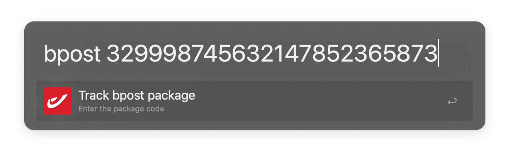

# Alfred Workflows
A collection of Alfred 4 workflows I developed.

## Open Applications
Opens the /Applications folder in Finder.

```shell
$ app
```

## bpost Track & Trace


Opens bpost's track and trace page for the `trackingNumber` you provide. Make sure to set the `postalCode` variable in advance, as this is used to verify your request.

```shell
$ bpost $trackingNumber
```

## Chrome Passwords
Opens Chrome's stored passwords in a new browser tab.

```shell
$ pw
```
